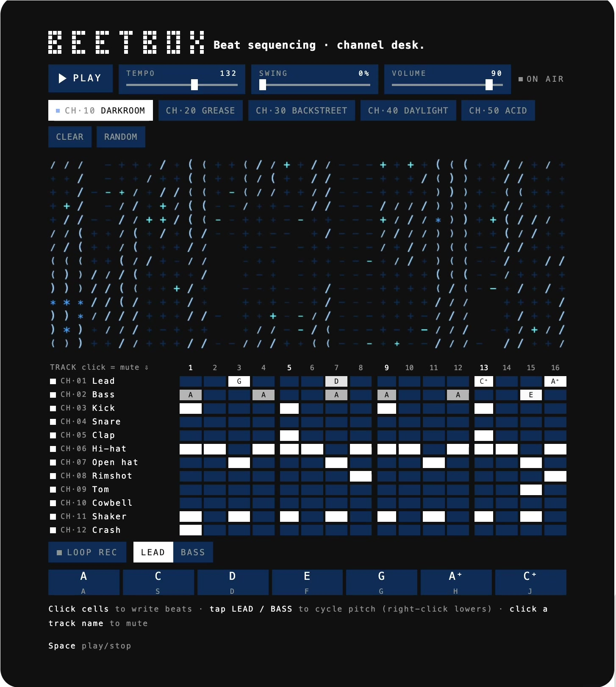
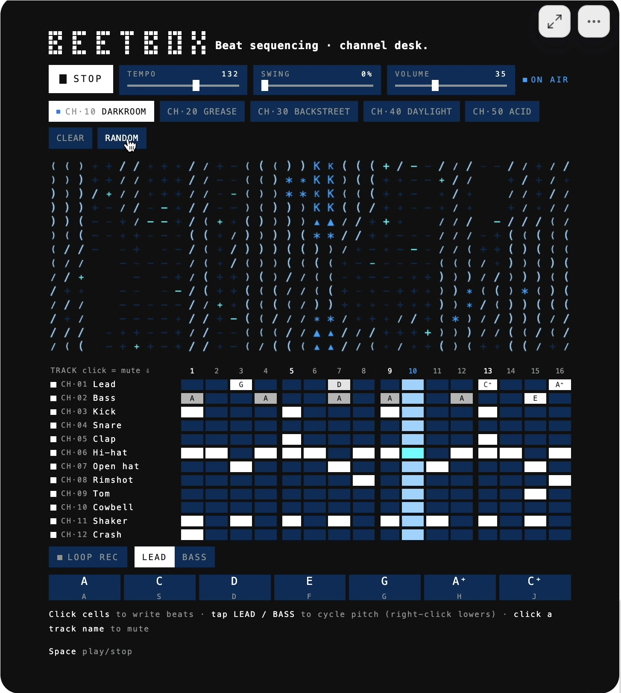
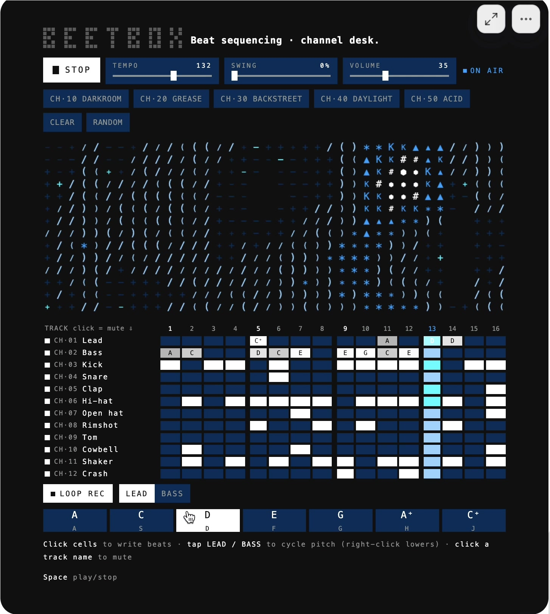
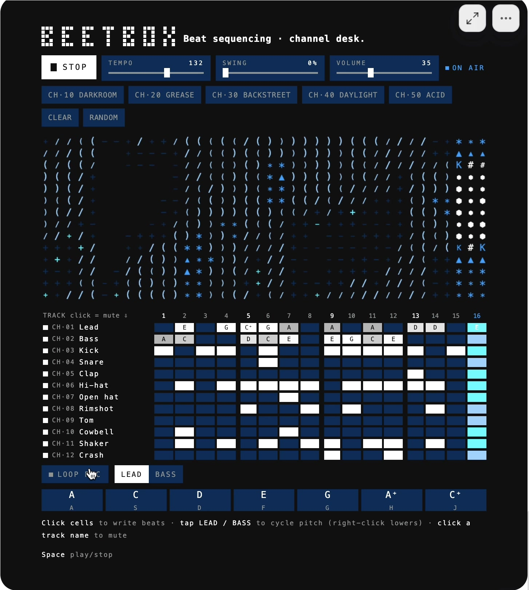
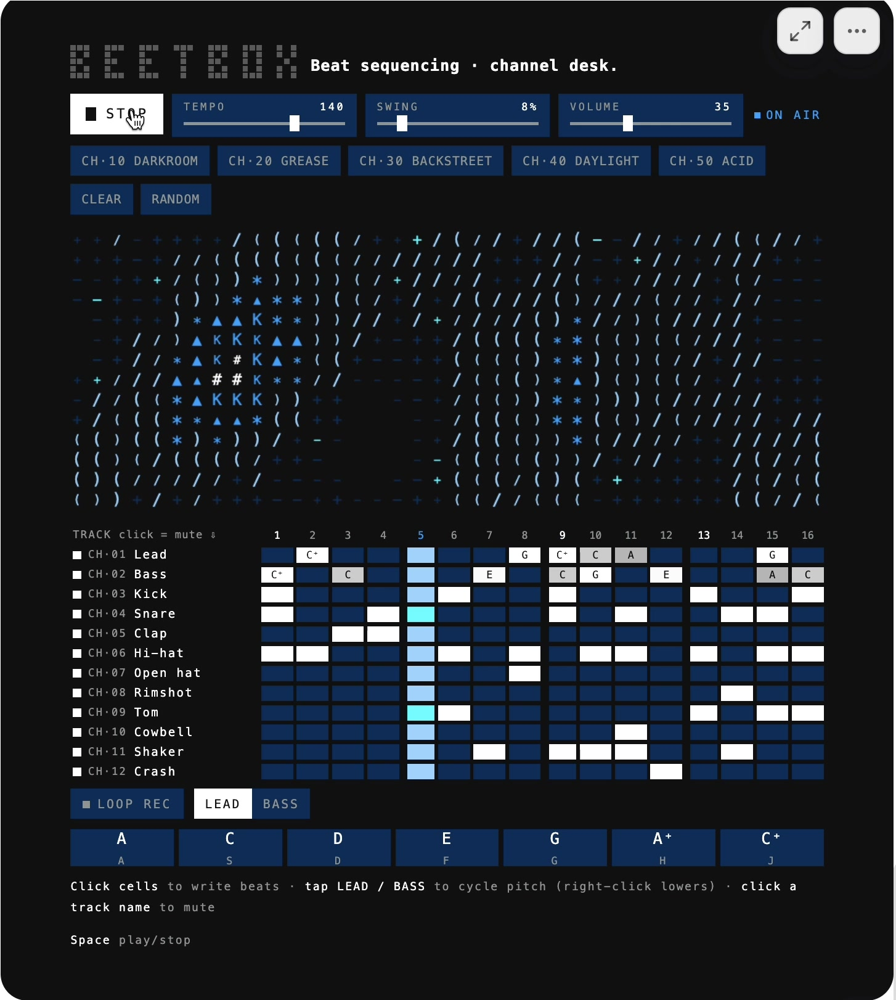
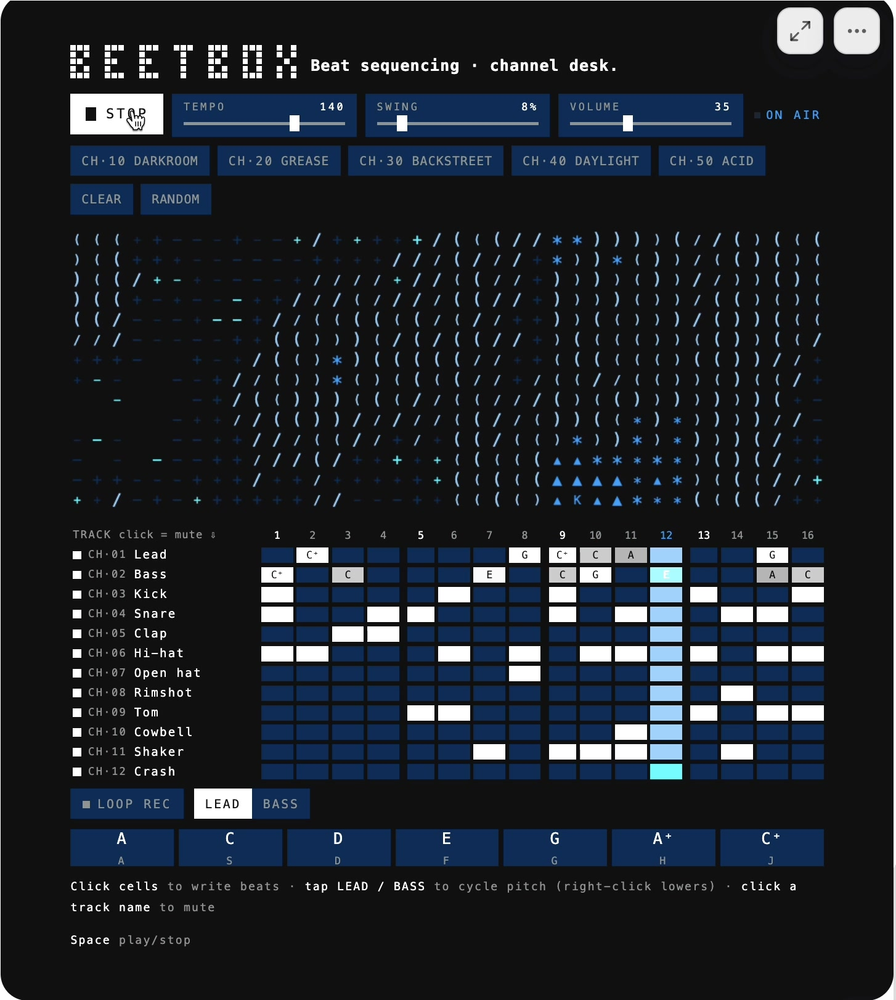

# [Beetbox Model Arena](https://keunwoochoi.github.io/beetbox-eval/)

Beetbox Model Arena is an independent experiment in visual-to-code reconstruction. It compares interactive web implementations produced by different coding models from the same short prompt and the same 19-second reference video.

**This is an independent educational and research project. It is not affiliated with, endorsed by, or sponsored by Kimi or Moonshot AI.**

---

# Making Beetbox Eval Arena

@keunwoochoi, July 2026

I saw a short screen recording of Beetbox in the [Kimi K3 release post](https://www.kimi.com/blog/kimi-k3), but without any interactive demo. Well... If they could prompt, I can prompt it too. Even better that I have a working video of the app.

So I gave several coding agents the same screen recording, screenshots extracted at one-second intervals, and a short prompt asking them to reconstruct the application autonomously.

Once they were done, I realized the responsibility as a human... to judge them! *cough cough taste is the moat cough cough*, so I did it, and realized perhaps that is my biggest contribution to this webpage.

This is not intended to be a rigorously controlled benchmark. A K=1 trial is noisy, and I forgot to log their token usage. Still, I found the task useful because a single output exposes several different capabilities: visual understanding, frontend implementation, audio synthesis, musical interpretation, interaction design, and the ability to finish a working product without detailed instructions.

**[Open the Beetbox Eval Arena](https://keunwoochoi.github.io/beetbox-eval/)**

## 1. The original input

Each agent received:

1. The 19-second Beetbox screen recording from the Kimi K3 release post
2. Screenshots extracted from the recording at one frame per second
3. One short text prompt

### 1.1 Video and extracted frames

<strong><a href="prompt/beetbox.mov">▶ Watch the 19-second prompt video</a></strong>

  
  
  
  
  
  

### 1.2 Prompt

> Recreate the Beetbox web app shown in `beetbox.mov` and `beetbox_frames/` as faithfully as possible. Work autonomously and place the complete implementation in the current directory.

I provided the extracted frames because not every model or coding-agent environment could directly process a video. The frames reduced that difference and also made it easier for the agents to inspect individual states of the interface.

There was one exception. GPT-5.6 Luna received a retry after its first implementation did not produce sound. For the retry, I added one sentence: “It should produce sound.” Now that I think about it, I am not sure if that was fair.

## 2. A personal vibe check

I think of this as a personal vibe check for coding agents.

There are many small prompts people use to get a quick sense of a generative model. “An astronaut riding a horse” became a familiar image-generation example. Simon Willison uses “[Generate an SVG of a pelican riding a bicycle](https://simonwillison.net/2025/Jun/6/six-months-in-llms/)” as a lightweight benchmark for coding-capable LLMs.

  
  

Examples from <a href="https://simonwillison.net/2025/Jun/6/six-months-in-llms/">Simon Willison’s pelican benchmark</a> and the <a href="https://www.tensorflow.org/tutorials/generative/generate_images_with_stable_diffusion">TensorFlow Stable Diffusion tutorial</a>.

Those results can be understood almost immediately. It takes very little time to see whether an image is impressive, broken, or both.

Beetbox is not as universally or immediately readable. You need to spend some time with each result. Some details are mainly interesting if you care about music, audio, or interface implementation. But for a music geek like me, it is a useful example.

The input is small, but completing it reasonably well requires several capabilities at once:

- **Image understanding:** Reading an interface from a video and screenshots
- **Music:** Implementing a functional step sequencer
- **Music:** Reading and interpreting musical notation
- **Audio and music:** Producing sound rather than only visual playback
- **Audio and music:** Making tempo, swing, volume, muting, presets, and playback work together
- **Product and frontend:** Inferring interactions that are not fully demonstrated or specified

## 3. Models and coding agents

These are individual runs produced with different combinations of models, effort settings, and coding tools.

| Model | Effort | Coding tool | Input price ($/M tokens) |
| --- | --- | --- | ---: |
| GPT-5.6 Sol | xhigh | Codex CLI | 5 |
| GPT-5.6 Sol | medium | Codex CLI | 5 |
| GPT-5.6 Terra | high | Codex CLI | 2.5 |
| GPT-5.6 Luna | high | Codex CLI | 1 |
| GPT-5.4 | default | Codex CLI | 2.5 |
| GPT-5.4 Mini | default | Codex CLI | 0.75 |
| GPT-5.3 Codex Spark | default | Codex CLI | 1.75 |
| Claude Fable 5 | xhigh | Claude Code | 10 |
| Claude Opus 4.8 | xhigh | Claude Code | 5 |
| Claude Sonnet 5 | high | Claude Code | 3 |
| Claude Haiku 4.5 | default | Claude Code | 1 |
| MiniMax M3 | default | OpenCode | 0.6 |
| Qwen3.7 Plus | default | OpenCode | 0.4 |
| Kimi K3 | default | OpenCode | 3 |

“Model” and “coding agent” are not interchangeable here. The result depends on the model, effort setting, coding tool, system prompt, available tools, and environment. I did not isolate these variables. Each entry is also only one run, not an estimate of the model’s average performance.

The prices are rough context only. They are uncached input prices at the time I added the models, not the actual total cost of each run.

## 4. What I evaluated

The arena currently shows three manually judged columns. I intentionally used only green, yellow, and red. More detailed scores would imply more precision than I have.

### 4.1 Audio

Audio asks whether sound works and whether the instruments, levels, balance, and behavior make a convincing audio product.

- **Green:** Sound works and is reasonably well implemented.
- **Yellow:** Sound works, but there are noticeable quality, balance, or instrument problems.
- **Red:** Sound is absent or substantially broken.

An implementation can visually play while producing no sound. It can also contain twelve technically functioning instruments while one of them is nearly inaudible, the overall volume is very low, or a hi-hat completely overwhelms everything else. Those details matter in an actual musical web application.

### 4.2 Visual prompt analysis

Visual Prompt Analysis asks whether the agent correctly understood important information shown in the recording and extracted frames.

- **Green:** Important visual details were read correctly.
- **Yellow:** Most were understood, with some likely mistakes.
- **Red:** Important details were substantially misunderstood.

One concrete example is the lead row. At beats 13 and 16, the recording shows `C+` and `A+`, which appear to mean notes one octave higher. Some agents seem to have read these as `C#` and `A#`.

This is a small detail, but it is useful because it connects visual understanding directly to the application’s behavior. It is not merely a typography error if the implementation plays a different pitch.

This column is not intended to represent overall visual similarity.

### 4.3 Musicality

Musicality asks whether the notes shown in the sequencer are actually played at the expected pitches and tuning.

- **Green:** The relevant notes and pitches are correct.
- **Yellow:** The result is broadly similar but contains pitch or tuning errors.
- **Red:** The musical output is missing or substantially incorrect.

I separated this from Audio because they are different problems. A lead can play the wrong pitch with a perfectly functional synthesizer. A sequencer can play all the correct notes while using an extremely unpleasant hi-hat sound. The first belongs under Musicality; the second belongs under Audio.

## 5. Other things worth evaluating

There are several other useful dimensions that I did not reduce to a score.

### 5.1 Functional controls

Playback, tempo, swing, volume, track muting, sequencer cells, and presets should work. A reconstruction that only resembles the recording visually is incomplete.

### 5.2 Preset interpretation

The recording includes presets named Darkroom, Grease, Backstreet, Daylight, and Acid.

Are the presets meaningfully different? Does Acid resemble an acid-oriented rhythm or timbre? What does an agent infer from a less literal name such as Daylight? Are the resulting patterns musically plausible?

This is interesting, but much more subjective.

### 5.3 ASCII visualization

On top of the MIDI-like notes, the reference contains a visualization made from ASCII characters. A result can be judged by whether it reacts to playback, whether it resembles the original, whether it is merely random decoration, and whether it is aesthetically interesting.

Again, I found this worth looking at, but difficult to turn into a trustworthy score.

### 5.4 Product completeness

Small details distinguish a working product from a screenshot reconstruction:

- Sensible default volume
- Reasonably normalized instruments
- No unexpectedly dominant sound
- Controls that update their displayed values
- Reliable playback after repeated interactions
- A usable layout across browsers and screen sizes

## 6. What I observed

### 6.1 Faithfulness versus interpretation

Comparing GPT-5.6 Sol at xhigh effort with Claude Fable 5 made one commonly reported difference between GPT and Claude much clearer to me.

GPT was more religious about following the input. Its ASCII visualization, in particular, closely reconstructed what was visible in the recording. Fable took more freedom. Its gradients are smoother, more complicated, and honestly very cool, but less literal. Opus showed a similar tendency.

Which behavior is better depends on what the user wants. For this reconstruction task, GPT’s restraint was probably preferable: an attractive addition can still be an error when it was not requested. For a less specified task, Claude’s willingness to assume more and exercise its own taste may produce the more interesting result. Sometimes it behaves as if it knows what would make the product better than the user does. Sometimes it may actually be right. Other times, that is precisely the problem.

This is one task and one run per configuration, not a general conclusion about either model family. But it gave me a concrete example of a difference many users have described: GPT tried harder not to cross the boundary of the prompt, while Claude treated the prompt as a starting point and made more decisions on my behalf.

### 6.2 Looking correct is not the same as working

Several agents reconstructed the visible interface reasonably well but did not produce sound. The reference video itself was silent, but the product being reconstructed was clearly a musical sequencer. Some agents inferred that sound was part of the job. Others stopped at the visual layer.

### 6.3 Small visual details propagate into behavior

The `A+` and `C+` example connects visual recognition, transcription, musical interpretation, and audio implementation. Once I noticed it, I could not treat visual similarity and musical behavior as independent questions.

### 6.4 Audio quality varies independently

Some implementations played approximately the expected notes but used poor synthesis or mixing. Others produced better sound while misunderstanding part of the written sequence. This is why Audio and Musicality became separate columns.

### 6.5 Autonomous completion requires assumptions

The prompt did not specify a framework, synthesis method, preset contents, or visualization algorithm. Each agent had to decide what the missing implementation should be.

Those decisions revealed different priorities: visual similarity, functional completeness, musical plausibility, adding something interesting, or simply finishing something that runs.

## 7. Building the arena with coding agents

All the implementations were written by coding agents. The arena was, too.

My role was mostly to run the agents, look at the results, interact with them, and complain about what was wrong. Then the agent changed the code, I looked again, and I complained again. This continued for quite a while.

### 7.1 The first output was never the end

Making the first version was easy. I asked the agent to collect the implementations into an arena where I could view and compare them. It produced one.

Technically, it worked. But the initial versions had so many things that I did not ask for:

- Explanations
- Status indicators
- Legends
- Captions
- Secondary labels
- Provider abbreviations
- Navigation hints
- Extra buttons
- Readiness information
- Repeated indications of which model was selected
- Instructions telling users how to interact with the page

There was text everywhere. Tiny explanations, small status messages, tooltips, and labels describing other labels. The website behaved a little like a preacher. It really wanted to make sure that the user understood every single thing it had implemented.

This happened repeatedly. I would remove one layer of information, and the agent would add another helpful-looking label somewhere else.

### 7.2 Most of my prompts were “delete this”

I did not count them exactly, but perhaps 80–90% of my instructions while building the arena were requests to remove something:

- Remove “Run catalog.”
- Remove “Pinned.”
- Remove the readiness indicators.
- Remove the readiness guide.
- Remove the preview count.
- Remove the playback instructions.
- Remove the status bar.
- Remove the implementation count.
- Remove the redundant model selectors.
- Remove the panel saying which model was already selected.
- Remove Reload.
- Remove Open.
- Remove the implementation label.
- Remove the original-input label.
- Remove the reference controls from mobile.
- Remove the second line from the About button.
- Remove the explanation I did not ask you to add.
- ...

Only after removing most of these things did the website stop looking like an AI-generated website.

The problem was that the agent treated every possible ambiguity as something that should be resolved by adding text or another control. Each addition was locally defensible. Together, they made the page noisy and difficult to understand.

Humans do this too, of course. But coding agents seem particularly eager to demonstrate that they considered every state and every feature. They implement something, label it, explain it, and sometimes add another label explaining how to use it.

## 8. Limitations

- This is one task.
- There is generally one run per configuration.
- Models, effort settings, coding tools, system prompts, and available environments differ.
- The results were not evaluated blindly.
- The ratings were assigned manually by one person.
- Some criteria are subjective.
- The green, yellow, and red ratings intentionally discard detail.
- The evaluation criteria developed after I had already inspected the outputs.
- Luna received a retry with an additional instruction.
- Model pricing and availability may change.

The results should therefore be read as individual artifacts, not as general rankings of the underlying models.

## 9. Closing

At the end, you learn much more by actually using something and trying to make something yourself.

I already use coding agents extensively for my main work. Still, through this project, I learned more about the differences between models, how they interpret instructions, where they make assumptions, and what using an agentic coding tool is actually like.

Reading benchmarks and other people’s impressions is useful. But it is different from choosing a problem that you understand, giving it to several models, and spending enough time with the results to notice what each one did well or badly.

So my conclusion is simple: try these models! Make something that you actually care about!

**[Open the Beetbox Eval Arena](https://keunwoochoi.github.io/beetbox-eval/)**
